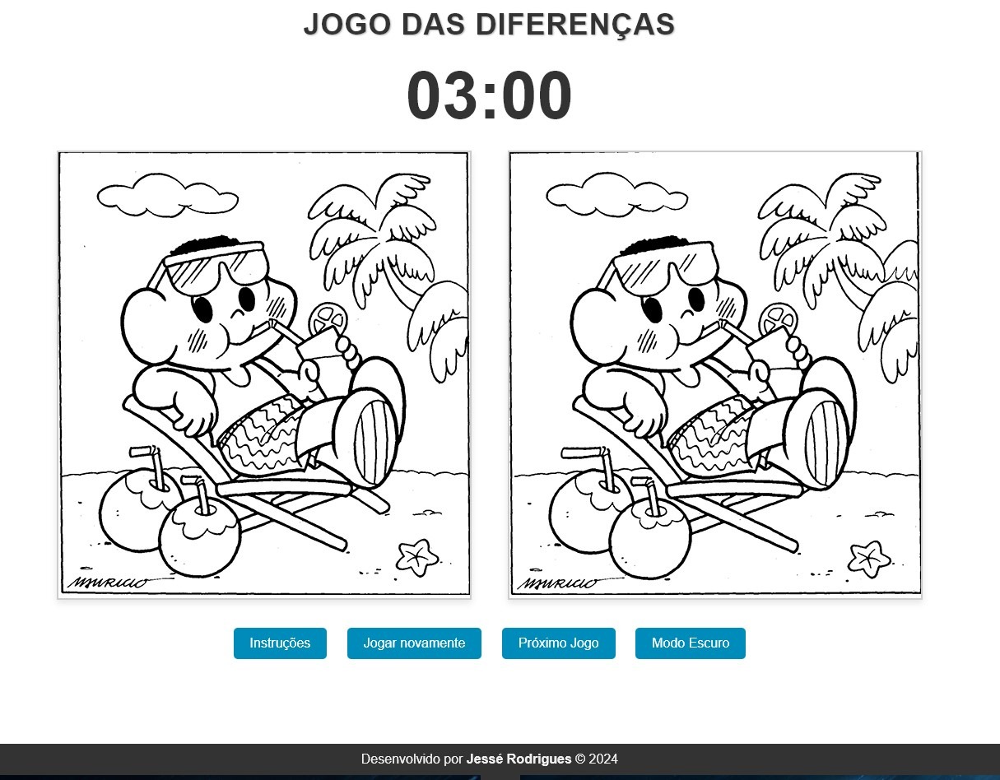

# Encontre os Erros - Jogo Interativo

Este é um jogo interativo onde o objetivo é encontrar erros entre duas imagens aparentemente idênticas. Desenvolvido como parte de um projeto para demonstrar habilidades em desenvolvimento web utilizando HTML, CSS e JavaScript.



## Como Jogar

1. **Início**: Ao iniciar o jogo, você verá duas imagens lado a lado. O desafio é encontrar todas as diferenças entre elas clicando nas áreas onde os erros estão presentes.

2. **Funcionalidades**:
   - Clique nas áreas suspeitas para marcar erros.
   - Um marcador será colocado nas coordenadas onde você clica.
   - O jogo termina quando todos os erros são encontrados ou quando o tempo se esgota.

3. **Temporizador**: O jogo possui um temporizador de 3 minutos. Encontre todos os erros antes que o tempo acabe!

4. **Feedback**: Após encontrar todos os erros, uma mensagem será exibida informando seu desempenho.

## Tecnologias Utilizadas

- HTML5
- CSS3 (incluindo Flexbox e Media Queries para responsividade)
- JavaScript (jQuery para manipulação de DOM e eventos)

## Pré-requisitos

- Navegador web moderno que suporte HTML5, CSS3 e JavaScript.

## Instalação

1. Clone o repositório:
   ```bash
   git clone https://github.com/seu-usuario/nome-do-repositorio.git
